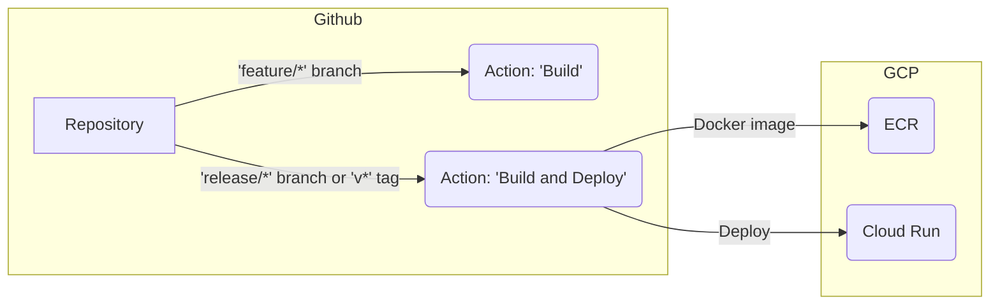

CI/CD pipeline

```mermaid
  flowchart LR
    subgraph Github
    A[Repository] -->|'feature/*' branch| B(Action: 'Build')
    A[Repository] -->|'release/*' branch or 'v*' tag| C(Action: 'Build and Deploy')
    end

    subgraph GCP
    C(Action: 'Build and Deploy') -->|Docker image| D(ECR)
    C(Action: 'Build and Deploy') -->|Deploy| E(Cloud Run)
    end
```
